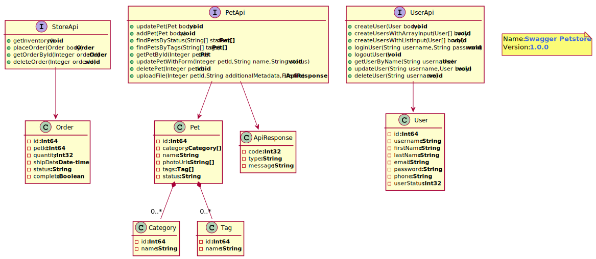

# OpenAPI2Puml

OpenApi to Plant UML conversion tool generates UML Class Diagrams from an Open API definition.

This is a fork of the original project Swagger2puml (https://github.com/kicksolutions/swagger2puml) which seems to have been dormant for some time.

The original developers of Swagger2puml are:
- Santosh Manapragada https://github.com/msantosh1188
- Manisha Bardiya https://github.com/manishabardiya

This project is based on Maven.
Following are modules we currently have 

- openapi2puml-core

Following are the tools which this project internally uses:

- [Swagger Parser]
- [Plant UML]
- [Graphviz]
- [Mustache]

# How does it work

- Input: Openapi2Puml parses the swagger definition from input using [Swagger Parser] 
- Transform: The swagger definition is built into an object model 
- Output: The object model is transformed into a [Plant UML] file using a [Mustache] template. Optionally a .svg 
image can be generated also. 


## openapi2puml-core: 

This utility takes OpenAPI Yaml or JSON as input generates swagger.puml and swagger.svg files as output.

Below is the Sample Class Diagram generated by the application.
To see the generated PUML file, please click [here](examples/swagger.puml)



### Building:

```
mvn package
```

The jar is built with dependencies and placed in the root of the project.

### Usage:

```
java -jar openapi2puml.jar [options]

-i {Path of Swagger Definition (Can be either Yaml or json)}
-o {Target location where Puml File and Image should generated}
-generateDefinitionModelOnly {true/flase Defult False (Optional)}
-includeCardinality {true/flase Defult true (Optional)}
-generateSvg true/false; Default=true 

```

License
----

Apacahe 2.0

[Plant UML]: <https://github.com/plantuml/plantuml>
[Swagger]: <https://swagger.io/>
[Swagger Parser]: <https://github.com/swagger-api/swagger-parser>
[Graphviz]: <https://graphviz.gitlab.io/>
[Mustache]: <https://github.com/spullara/mustache.java>
